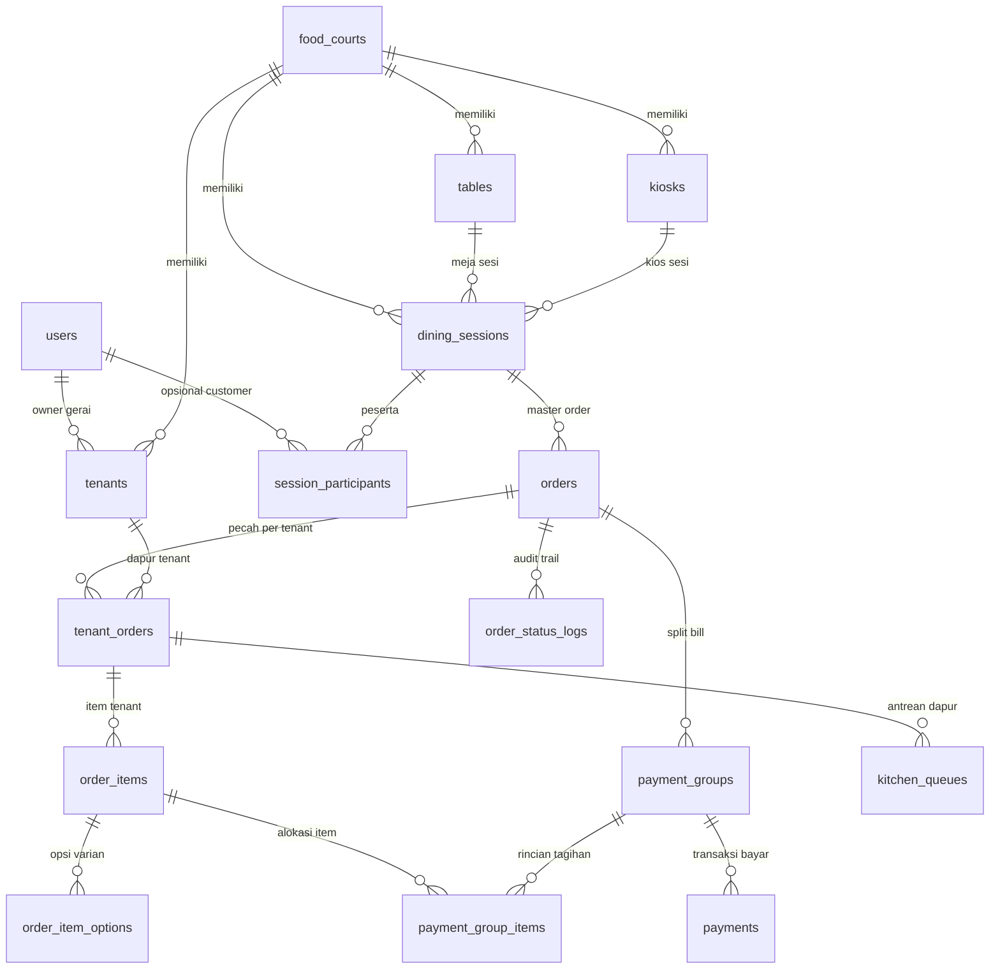

# Rangkuman & Panduan Ordering System (Food Court API)

Dokumen ini berisi rangkuman arsitektur, alur bisnis, struktur kode, daftar endpoint per alur, dan checklist pengembangan modul **Ordering System** pada proyek `food-court-api`. Dibuat sebagai catatan referensi pengembangan backend.

---

## 1. Ringkasan Tech Stack & Arsitektur

- **Runtime & Package Manager:** [Bun](https://bun.sh)
- **Web Framework:** [ElysiaJS](https://elysiajs.com) (TypeScript-first, performa tinggi, validasi berbasis TypeBox)
- **Database & ORM:** MySQL (Laragon / XAMPP) dengan [Drizzle ORM](https://orm.drizzle.team) & `drizzle-kit`
- **Autentikasi & Otorisasi:** `@elysiajs/jwt` dengan Bearer token dan Role-based Access Control (`admin`, `tenant`, `customer`)
- **Dokumentasi API:** Swagger OpenAPI di `http://localhost:3000/swagger`

---

## 2. Struktur Modul Proyek (Feature-Based)

```text
src/
├── common/
│   ├── errors/           # Custom AppError (NotFoundError, BadRequestError, ForbiddenError, dll.)
│   └── middlewares/      # authPlugin, requireAuth, requireRoles
├── config/
│   └── env.ts            # Validasi konfigurasi environment variable (.env)
├── db/
│   ├── index.ts          # Inisialisasi pool koneksi MySQL Drizzle (mysql2/promise)
│   └── schema.ts         # Definisi 19 tabel, tipe data INT (Rupiah), & relasi Drizzle ORM
├── modules/
│   ├── auth/             # Registrasi & Login (admin, tenant, customer)
│   ├── tenants/          # Manajemen data gerai/kios food court
│   ├── menus/            # Manajemen kategori menu, menu makanan, & opsi varian
│   ├── tables/           # Manajemen meja makan food court & QR token
│   ├── orders/           # [FOKUS UTAMA] Modul pemesanan makanan, sesi meja & dapur
│   └── payments/         # Pembayaran pesanan, verifikasi tunai kasir, & split bill
└── index.ts              # Server entry point, mounting controller, Swagger, & global error handler
```

---

## 3. Arsitektur Data Multi-Tier (19 Tabel)



---

## 4. Rincian Endpoint Berdasarkan 4 Alur Bisnis

### Alur 1: Pelanggan & Meja (Customer & Table Ordering Flow) - [SELESAI]
Fokus pada inisialisasi sesi meja, pemesanan multi-tenant, snapshot harga, dan pelacakan publik.

| Method | Endpoint | Hak Akses | Status | Deskripsi |
|---|---|---|---|---|
| `POST` | `/api/orders` | Publik / Customer | **Aktif** | Buat pesanan baru via meja (`tableId`) atau sesi. Otomatis mengunci meja jadi `occupied`, pecah sub-order stan (`tenant_orders`), dan buat tagihan default. |
| `GET` | `/api/orders` | Berdasarkan Role | **Aktif** | List pesanan terfilter: Admin (semua), Tenant (item stannya), Customer (pesanannya), Guest (via query `tableId`). |
| `GET` | `/api/orders/:id` | Publik / Pemilik | **Aktif** | Detail pesanan lengkap beserta status sub-order kios, snapshot menu, dan rincian tagihan. |
| `GET` | `/api/orders/track/:orderNumber` | Publik | **Aktif** | Pelacakan status pesanan secara publik (menampilkan status masak per stan dan nomor antrean dapur). |
| `POST` | `/api/orders/sessions/join` | Publik | **Aktif** | Bergabung ke sesi meja makan bersama via scan `qrToken` atau input `sessionCode`. |

---

### Alur 2: Dapur Tenant (Kitchen Queue & Kitchen Display System) - [TODO / NANTI]
Fokus pada operasional dapur kios mandiri, antrean memasak (KDS), estimasi waktu, dan panggilan pesanan siap ambil.

| Method | Endpoint | Hak Akses | Status | Deskripsi |
|---|---|---|---|---|
| `GET` | `/api/kitchen/queue` | Tenant | **Rencana** | **Kitchen Display System (KDS)**: Mengambil antrean pesanan aktif stan tenant yang sedang login (`QUEUED`, `COOKING`, `READY`), diurutkan berdasarkan waktu masuk antrean (`queued_at`). |
| `PATCH` | `/api/orders/tenant-orders/:id/status` | Tenant Stan Terkait | **Aktif (Basic)** | Memperbarui status memasak sub-order stan (`WAITING_PAYMENT` $\rightarrow$ `QUEUED` $\rightarrow$ `PREPARING` $\rightarrow$ `READY` $\rightarrow$ `COMPLETED`). |
| `POST` | `/api/kitchen/queue/:queueId/call` | Tenant Stan Terkait | **Rencana** | **Panggil Pelanggan**: Mengirimkan notifikasi / tanda bahwa pesanan nomor antrean tersebut sudah `READY` dan siap diambil di stan (*buzzer/screen call*). |
| `GET` | `/api/kitchen/stats` | Tenant / Admin | **Rencana** | **Statistik Dapur**: Rata-rata waktu masak (*average cooking time*), jumlah porsi terjual per menu hari ini, dan beban antrean saat ini. |

---

### Alur 3: Pembayaran Kasir & Split Bill (Cash Flow & Split Billing) - [TODO / NANTI]
Fokus pada penerimaan uang fisik oleh kasir/tenant, pembagian tagihan (split bill) antar peserta meja, dan integrasi multi-provider pembayaran.

| Method | Endpoint | Hak Akses | Status | Deskripsi |
|---|---|---|---|---|
| `POST` | `/api/payments` | Publik / Kasir / Tenant | **Aktif** | Proses pembayaran pesanan: Mendukung QRIS (langsung sukses) atau Tunai (`CASH`). Otomatis mengubah status order ke `CONFIRMED` dan antrean dapur ke `QUEUED`. |
| `POST` | `/api/payments/cash/verify` | Kasir (Admin) / Tenant | **Rencana** | **Verifikasi Pembayaran Tunai Fisik**: Kasir atau Tenant memverifikasi bahwa uang fisik dari pelanggan telah diterima di kasir dengan mencatat nominal uang diterima dan uang kembalian (*cash change*). |
| `POST` | `/api/orders/:id/split-bill` | Publik / Host Sesi | **Rencana** | **Bagi Tagihan (Split Bill)**: Memecah master order ke beberapa `payment_groups` berdasarkan pembagian item menu per peserta meja (`session_participants`). |
| `GET` | `/api/orders/:id/bills` | Publik / Peserta | **Rencana** | **Rincian Tagihan per Peserta**: Melihat nominal yang harus dibayar oleh masing-masing peserta di meja makan beserta status lunas per orang. |
| `POST` | `/api/payments/groups/:paymentGroupId` | Publik / Peserta | **Rencana** | **Bayar Tagihan Peserta**: Pelanggan membayar tagihan bagiannya sendiri secara mandiri via QRIS / E-Wallet. |

---

### Alur 4: Penyelesaian Sesi, Pelepasan Meja & Audit Log (Completion & Analytics) - [TODO / NANTI]
Fokus pada penutupan sesi makan, pembebasan meja otomatis, pencatatan log audit transisi status, dan laporan penjualan.

| Method | Endpoint | Hak Akses | Status | Deskripsi |
|---|---|---|---|---|
| `PATCH` | `/api/orders/:id/status` | Tenant / Admin | **Aktif** | Mengubah status pesanan ke `COMPLETED` atau `CANCELLED`. Menutup `dining_sessions` dan otomatis mengembalikan status meja ke `available`. |
| `POST` | `/api/sessions/:id/complete` | Tenant / Admin | **Rencana** | **Tutup Sesi Meja Manual**: Membebaskan meja makan secara paksa jika pelanggan sudah beranjak pergi tanpa menunggu seluruh piring diambil. |
| `GET` | `/api/orders/:id/logs` | Admin / Tenant | **Rencana** | **Riwayat Status (Audit Trail)**: Menampilkan kronologi perjalanan status pesanan dari `order_status_logs` (kapan dibuat, kapan lunas, kapan mulai dimasak, kapan siap saji). |
| `GET` | `/api/reports/sales` | Admin / Tenant | **Rencana** | **Laporan Penjualan**: Rekap total omzet, jumlah transaksi, metode pembayaran terpopuler, dan menu terlaris per rentang tanggal. |

---

## 5. Checklist Rencana Pengerjaan Berikutnya

Gunakan checklist ini sebagai panduan saat melanjutkan pengembangan:

- [x] **Alur 1: Pelanggan & Meja (Customer & Table Ordering Flow)**
  - [x] Implementasi 19 tabel komprehensif Drizzle ORM.
  - [x] Resolusi sesi meja otomatis & penguncian meja (`occupied`).
  - [x] Snapshot harga dan nama menu di `order_items`.
  - [x] Pemecahan sub-order per kios di `tenant_orders`.
  - [x] Antrean awal dapur di `kitchen_queues`.
  - [x] Pelacakan publik via `GET /api/orders/track/:orderNumber`.
  - [x] Test suite E2E lengkap (`test/customer_table_flow.test.ts` - 100% pass).

- [ ] **Alur 2: Dapur Tenant (Kitchen Queue / KDS)**
  - [ ] Buat endpoint `GET /api/kitchen/queue` untuk tampilan monitor dapur (KDS) terurut waktu.
  - [ ] Implementasikan endpoint `POST /api/kitchen/queue/:queueId/call` untuk pemanggilan pesanan siap saji.
  - [ ] Tambahkan kalkulasi estimasi waktu persiapan (`preparation_time`).
  - [ ] Tulis test suite `test/kitchen_queue_flow.test.ts`.

- [ ] **Alur 3: Pembayaran Kasir & Split Bill**
  - [ ] Endpoint `POST /api/orders/:id/split-bill` untuk mengalokasikan item ke `payment_group_items`.
  - [ ] Endpoint `GET /api/orders/:id/bills` untuk melihat rincian tagihan per individu di meja.
  - [ ] Logika kalkulasi uang kembalian pada pembayaran tunai di kasir (`POST /api/payments/cash/verify`).
  - [ ] Transisi otomatis master order ke `PAID` hanya ketika seluruh `payment_groups` berstatus `PAID`.
  - [ ] Tulis test suite `test/split_bill_payment.test.ts`.

- [ ] **Alur 4: Penyelesaian Sesi, Audit Trail & Laporan**
  - [ ] Endpoint `GET /api/orders/:id/logs` untuk melihat kronologi perjalanan pesanan.
  - [ ] Endpoint `POST /api/sessions/:id/complete` untuk membebaskan meja secara manual.
  - [ ] Endpoint analitik `GET /api/reports/sales` (omzet, transaksi, dan menu terlaris).
  - [ ] Tulis test suite `test/session_lifecycle_reports.test.ts`.

---

## 6. Perintah Penting

```bash
# 1. Menjalankan server development (hot-reload)
bun run dev

# 2. Menjalankan seluruh automated test (harus hijau semua)
bun test

# 3. Sinkronisasi skema Drizzle ke database MySQL di Laragon
bun run db:push

# 4. Membuka Drizzle Studio (Database GUI Viewer di Browser)
bun run db:studio
```
