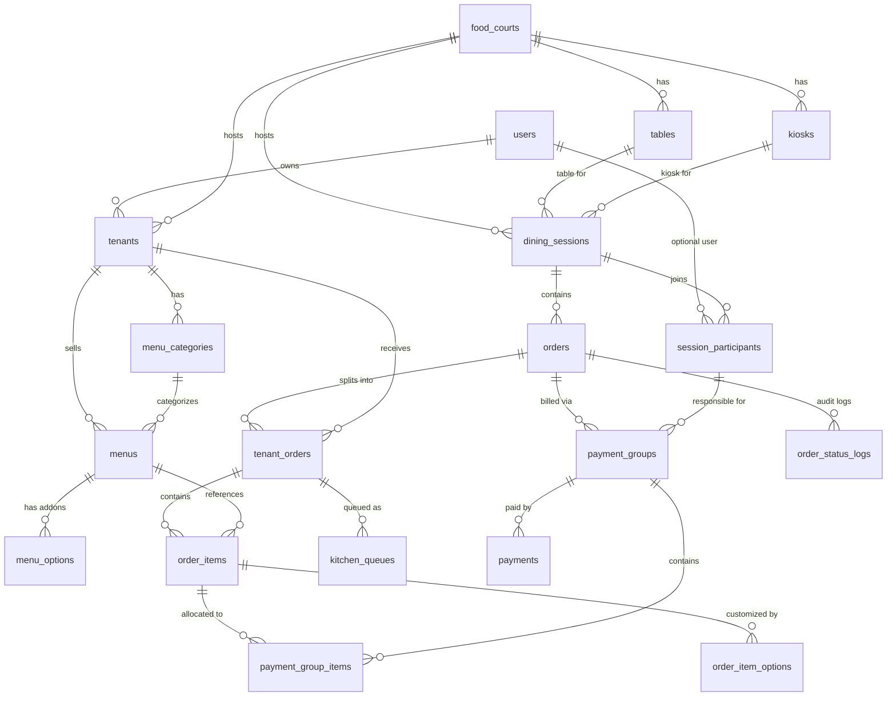

# Spesifikasi Desain: Food Court API Database & Architecture Redesign

- **Tanggal**: 2026-09-16
- **Status**: Draft Disetujui
- **Pendekatan**: Pendekatan 1 (Clean Evolution with Seamless Gateway)

---

## 1. Ringkasan & Tujuan

Dokumen ini mendefinisikan rancangan arsitektur basis data komprehensif (19 tabel) dan alur bisnis sistem pemesanan makanan (*Food Court API*). Rancangan ini mengharmonisasikan draf skema *brainstorming* (Enterprise Multi-Tenant, Dining Sessions, Split Bill, Kitchen Queues, Snapshots) dengan basis kode existing ([src/db/schema.ts](file:///c:/Users/Nanda/Documents/Kuliah/Backend/food-court-api/src/db/schema.ts) dan [ORDERING_SYSTEM_NOTES.md](file:///c:/Users/Nanda/Documents/Kuliah/Backend/food-court-api/ORDERING_SYSTEM_NOTES.md)).

### Keputusan Kunci
1. **Mempertahankan Tabel `users` & RBAC**: Admin dan Tenant tetap menggunakan autentikasi JWT existing. Kios dihubungkan ke akun pemilik (`tenants.owner_id -> users.id`), dan peserta sesi makan dapat opsional dihubungkan ke member (`session_participants.user_id -> users.id`).
2. **Mata Uang Rupiah (INT)**: Seluruh atribut harga (`price`, `subtotal`, `amount`, dsb.) menggunakan bilangan bulat `INT` sesuai standar transaksi kuliner Indonesia tanpa sen.
3. **Penyelesaian Sesi oleh Tenant**: Selain Admin, **Tenant** yang terlibat dalam pesanan memiliki wewenang untuk menyelesaikan sesi makan (`dining_sessions`) dan pesanan (`orders`) guna meningkatkan efisiensi operasional harian. Tersedia pula pemicu *auto-complete* saat seluruh pesanan kios telah selesai disajikan.
4. **Hierarki Pemesanan Multi-Tier**:
   $$\text{dining\_sessions} \rightarrow \text{orders} \rightarrow \text{tenant\_orders} \rightarrow \text{order\_items} \rightarrow \text{order\_item\_options}$$
5. **Split Bill Terstruktur**: Tagihan didistribusikan ke `payment_groups` dan `payment_group_items`, yang dibayar melalui record `payments`.

---

## 2. Diagram Relasi Entitas (ERD)

---

## 3. Definisi Skema Database (19 Tabel)

### 3.1. Akun & Lokasi Pusat
1. **`users`**
   - `id`: `varchar(36)` PK
   - `name`: `varchar(100)` NOT NULL
   - `email`: `varchar(191)` NOT NULL UNIQUE
   - `password_hash`: `varchar(255)` NOT NULL
   - `role`: `enum('admin', 'tenant', 'customer')` NOT NULL DEFAULT `'customer'`
   - `created_at`: `timestamp` NOT NULL DEFAULT `now()`
   - `updated_at`: `timestamp` NOT NULL DEFAULT `now()` ON UPDATE `now()`

2. **`food_courts`**
   - `id`: `varchar(36)` PK
   - `name`: `varchar(150)` NOT NULL
   - `slug`: `varchar(150)` NOT NULL UNIQUE
   - `address`: `text`
   - `phone`: `varchar(30)`
   - `logo`: `varchar(255)`
   - `status`: `enum('ACTIVE', 'INACTIVE')` NOT NULL DEFAULT `'ACTIVE'`
   - `created_at`: `timestamp` NOT NULL DEFAULT `now()`
   - `updated_at`: `timestamp` NOT NULL DEFAULT `now()` ON UPDATE `now()`

### 3.2. Meja, Kiosk, & Tenant
3. **`tables`**
   - `id`: `varchar(36)` PK
   - `food_court_id`: `varchar(36)` NOT NULL FK -> `food_courts.id` (ON DELETE CASCADE)
   - `table_number`: `varchar(20)` NOT NULL
   - `qr_token`: `varchar(100)` NOT NULL UNIQUE
   - `capacity`: `int` NOT NULL DEFAULT 4
   - `status`: `enum('AVAILABLE', 'OCCUPIED', 'DISABLED')` NOT NULL DEFAULT `'AVAILABLE'`
   - `created_at`: `timestamp` NOT NULL DEFAULT `now()`
   - `updated_at`: `timestamp` NOT NULL DEFAULT `now()` ON UPDATE `now()`
   - *Index/Unique*: `UNIQUE(food_court_id, table_number)`

4. **`kiosks`**
   - `id`: `varchar(36)` PK
   - `food_court_id`: `varchar(36)` NOT NULL FK -> `food_courts.id` (ON DELETE CASCADE)
   - `kiosk_name`: `varchar(100)` NOT NULL
   - `device_code`: `varchar(100)` NOT NULL UNIQUE
   - `location`: `varchar(100)`
   - `status`: `enum('ACTIVE', 'INACTIVE')` NOT NULL DEFAULT `'ACTIVE'`
   - `created_at`: `timestamp` NOT NULL DEFAULT `now()`
   - `updated_at`: `timestamp` NOT NULL DEFAULT `now()` ON UPDATE `now()`

5. **`tenants`**
   - `id`: `varchar(36)` PK
   - `food_court_id`: `varchar(36)` NOT NULL FK -> `food_courts.id` (ON DELETE CASCADE)
   - `owner_id`: `varchar(36)` NULL FK -> `users.id` (ON DELETE SET NULL)
   - `name`: `varchar(120)` NOT NULL
   - `slug`: `varchar(120)` NOT NULL
   - `stall_number`: `varchar(50)` NOT NULL
   - `description`: `text`
   - `logo`: `varchar(255)`
   - `is_open`: `boolean` NOT NULL DEFAULT true
   - `opening_time`: `varchar(8)` (format: "09:00:00")
   - `closing_time`: `varchar(8)` (format: "21:00:00")
   - `created_at`: `timestamp` NOT NULL DEFAULT `now()`
   - `updated_at`: `timestamp` NOT NULL DEFAULT `now()` ON UPDATE `now()`
   - *Index/Unique*: `UNIQUE(food_court_id, slug)`

### 3.3. Menu, Kategori, & Opsi Varian
6. **`menu_categories`**
   - `id`: `varchar(36)` PK
   - `tenant_id`: `varchar(36)` NOT NULL FK -> `tenants.id` (ON DELETE CASCADE)
   - `name`: `varchar(80)` NOT NULL
   - `sort_order`: `int` NOT NULL DEFAULT 0
   - `created_at`: `timestamp` NOT NULL DEFAULT `now()`
   - `updated_at`: `timestamp` NOT NULL DEFAULT `now()` ON UPDATE `now()`

7. **`menus`**
   - `id`: `varchar(36)` PK
   - `tenant_id`: `varchar(36)` NOT NULL FK -> `tenants.id` (ON DELETE CASCADE)
   - `category_id`: `varchar(36)` NULL FK -> `menu_categories.id` (ON DELETE SET NULL)
   - `name`: `varchar(150)` NOT NULL
   - `description`: `text`
   - `image_url`: `varchar(255)`
   - `price`: `int` NOT NULL
   - `stock`: `int` NOT NULL DEFAULT 0
   - `status`: `enum('AVAILABLE', 'OUT_OF_STOCK', 'HIDDEN')` NOT NULL DEFAULT `'AVAILABLE'`
   - `preparation_time`: `int` NOT NULL DEFAULT 15
   - `created_at`: `timestamp` NOT NULL DEFAULT `now()`
   - `updated_at`: `timestamp` NOT NULL DEFAULT `now()` ON UPDATE `now()`

8. **`menu_options`**
   - `id`: `varchar(36)` PK
   - `menu_id`: `varchar(36)` NOT NULL FK -> `menus.id` (ON DELETE CASCADE)
   - `name`: `varchar(100)` NOT NULL
   - `price_adjustment`: `int` NOT NULL DEFAULT 0
   - `created_at`: `timestamp` NOT NULL DEFAULT `now()`
   - `updated_at`: `timestamp` NOT NULL DEFAULT `now()` ON UPDATE `now()`

### 3.4. Sesi Makan & Peserta
9. **`dining_sessions`**
   - `id`: `varchar(36)` PK
   - `food_court_id`: `varchar(36)` NOT NULL FK -> `food_courts.id` (ON DELETE CASCADE)
   - `table_id`: `varchar(36)` NULL FK -> `tables.id` (ON DELETE SET NULL)
   - `kiosk_id`: `varchar(36)` NULL FK -> `kiosks.id` (ON DELETE SET NULL)
   - `session_code`: `varchar(20)` NOT NULL UNIQUE
   - `order_type`: `enum('DINE_IN', 'TAKEAWAY')` NOT NULL DEFAULT `'DINE_IN'`
   - `status`: `enum('ACTIVE', 'PAYMENT_PENDING', 'COMPLETED', 'CANCELLED', 'EXPIRED')` NOT NULL DEFAULT `'ACTIVE'`
   - `started_at`: `timestamp` NOT NULL DEFAULT `now()`
   - `expired_at`: `timestamp` NULL
   - `created_at`: `timestamp` NOT NULL DEFAULT `now()`
   - `updated_at`: `timestamp` NOT NULL DEFAULT `now()` ON UPDATE `now()`

10. **`session_participants`**
    - `id`: `varchar(36)` PK
    - `session_id`: `varchar(36)` NOT NULL FK -> `dining_sessions.id` (ON DELETE CASCADE)
    - `user_id`: `varchar(36)` NULL FK -> `users.id` (ON DELETE SET NULL)
    - `name`: `varchar(120)` NOT NULL
    - `device_token`: `varchar(255)`
    - `is_host`: `boolean` NOT NULL DEFAULT false
    - `joined_at`: `timestamp` NOT NULL DEFAULT `now()`
    - `created_at`: `timestamp` NOT NULL DEFAULT `now()`
    - `updated_at`: `timestamp` NOT NULL DEFAULT `now()` ON UPDATE `now()`

### 3.5. Pemesanan, Sub-Orders, & Kitchen
11. **`orders`**
    - `id`: `varchar(36)` PK
    - `session_id`: `varchar(36)` NOT NULL FK -> `dining_sessions.id` (ON DELETE CASCADE)
    - `order_number`: `varchar(30)` NOT NULL UNIQUE
    - `subtotal`: `int` NOT NULL DEFAULT 0
    - `tax_amount`: `int` NOT NULL DEFAULT 0
    - `service_fee`: `int` NOT NULL DEFAULT 0
    - `discount_amount`: `int` NOT NULL DEFAULT 0
    - `total_amount`: `int` NOT NULL DEFAULT 0
    - `payment_status`: `enum('PENDING', 'PARTIALLY_PAID', 'PAID', 'REFUNDED')` NOT NULL DEFAULT `'PENDING'`
    - `order_status`: `enum('DRAFT', 'CONFIRMED', 'SENT_TO_KITCHEN', 'COMPLETED', 'CANCELLED')` NOT NULL DEFAULT `'DRAFT'`
    - `notes`: `text`
    - `created_at`: `timestamp` NOT NULL DEFAULT `now()`
    - `updated_at`: `timestamp` NOT NULL DEFAULT `now()` ON UPDATE `now()`

12. **`tenant_orders`**
    - `id`: `varchar(36)` PK
    - `order_id`: `varchar(36)` NOT NULL FK -> `orders.id` (ON DELETE CASCADE)
    - `tenant_id`: `varchar(36)` NOT NULL FK -> `tenants.id` (ON DELETE CASCADE)
    - `subtotal`: `int` NOT NULL DEFAULT 0
    - `status`: `enum('WAITING_PAYMENT', 'QUEUED', 'PREPARING', 'READY', 'COMPLETED')` NOT NULL DEFAULT `'WAITING_PAYMENT'`
    - `sent_to_kitchen_at`: `timestamp` NULL
    - `created_at`: `timestamp` NOT NULL DEFAULT `now()`
    - `updated_at`: `timestamp` NOT NULL DEFAULT `now()` ON UPDATE `now()`

13. **`order_items`**
    - `id`: `varchar(36)` PK
    - `tenant_order_id`: `varchar(36)` NOT NULL FK -> `tenant_orders.id` (ON DELETE CASCADE)
    - `menu_id`: `varchar(36)` NULL FK -> `menus.id` (ON DELETE SET NULL)
    - `menu_name_snapshot`: `varchar(150)` NOT NULL
    - `unit_price_snapshot`: `int` NOT NULL
    - `quantity`: `int` NOT NULL DEFAULT 1
    - `subtotal`: `int` NOT NULL
    - `notes`: `text`
    - `created_at`: `timestamp` NOT NULL DEFAULT `now()`
    - `updated_at`: `timestamp` NOT NULL DEFAULT `now()` ON UPDATE `now()`

14. **`order_item_options`**
    - `id`: `varchar(36)` PK
    - `order_item_id`: `varchar(36)` NOT NULL FK -> `order_items.id` (ON DELETE CASCADE)
    - `option_name_snapshot`: `varchar(120)` NOT NULL
    - `price_adjustment_snapshot`: `int` NOT NULL DEFAULT 0
    - `created_at`: `timestamp` NOT NULL DEFAULT `now()`
    - `updated_at`: `timestamp` NOT NULL DEFAULT `now()` ON UPDATE `now()`

15. **`kitchen_queues`**
    - `id`: `varchar(36)` PK
    - `tenant_order_id`: `varchar(36)` NOT NULL FK -> `tenant_orders.id` (ON DELETE CASCADE)
    - `queue_number`: `varchar(20)` NOT NULL
    - `status`: `enum('QUEUED', 'COOKING', 'READY', 'PICKED_UP')` NOT NULL DEFAULT `'QUEUED'`
    - `queued_at`: `timestamp` NOT NULL DEFAULT `now()`
    - `started_at`: `timestamp` NULL
    - `finished_at`: `timestamp` NULL
    - `created_at`: `timestamp` NOT NULL DEFAULT `now()`
    - `updated_at`: `timestamp` NOT NULL DEFAULT `now()` ON UPDATE `now()`

16. **`order_status_logs`**
    - `id`: `varchar(36)` PK
    - `order_id`: `varchar(36)` NOT NULL FK -> `orders.id` (ON DELETE CASCADE)
    - `status`: `varchar(50)` NOT NULL
    - `description`: `text`
    - `created_at`: `timestamp` NOT NULL DEFAULT `now()`

### 3.6. Split Bill & Pembayaran
17. **`payment_groups`**
    - `id`: `varchar(36)` PK
    - `order_id`: `varchar(36)` NOT NULL FK -> `orders.id` (ON DELETE CASCADE)
    - `participant_id`: `varchar(36)` NOT NULL FK -> `session_participants.id` (ON DELETE CASCADE)
    - `amount_due`: `int` NOT NULL
    - `amount_paid`: `int` NOT NULL DEFAULT 0
    - `status`: `enum('PENDING', 'PAID', 'CANCELLED')` NOT NULL DEFAULT `'PENDING'`
    - `created_at`: `timestamp` NOT NULL DEFAULT `now()`
    - `updated_at`: `timestamp` NOT NULL DEFAULT `now()` ON UPDATE `now()`

18. **`payment_group_items`**
    - `id`: `varchar(36)` PK
    - `payment_group_id`: `varchar(36)` NOT NULL FK -> `payment_groups.id` (ON DELETE CASCADE)
    - `order_item_id`: `varchar(36)` NOT NULL FK -> `order_items.id` (ON DELETE CASCADE)
    - `allocated_amount`: `int` NOT NULL
    - `created_at`: `timestamp` NOT NULL DEFAULT `now()`
    - `updated_at`: `timestamp` NOT NULL DEFAULT `now()` ON UPDATE `now()`

19. **`payments`**
    - `id`: `varchar(36)` PK
    - `payment_group_id`: `varchar(36)` NOT NULL FK -> `payment_groups.id` (ON DELETE CASCADE)
    - `payment_reference`: `varchar(120)` NOT NULL UNIQUE
    - `payment_method`: `enum('QRIS', 'CASH', 'CARD', 'E_WALLET', 'BANK_TRANSFER')` NOT NULL
    - `provider`: `varchar(50)`
    - `amount`: `int` NOT NULL
    - `status`: `enum('PENDING', 'SUCCESS', 'FAILED', 'EXPIRED', 'REFUNDED')` NOT NULL DEFAULT `'PENDING'`
    - `paid_at`: `timestamp` NULL
    - `expired_at`: `timestamp` NULL
    - `created_at`: `timestamp` NOT NULL DEFAULT `now()`
    - `updated_at`: `timestamp` NOT NULL DEFAULT `now()` ON UPDATE `now()`

---

## 4. Hak Akses & Logika Penyelesaian Sesi

### 4.1. Wewenang Menyelesaikan Sesi Makan & Pesanan
* **Tenant**:
  - Tenant yang terlibat dalam pesanan dapat menyelesaikan status `tenant_orders` miliknya menjadi `COMPLETED` setelah makanan disajikan/diambil.
  - Tenant berwenang memanggil endpoint penyelesaian (`PATCH /api/orders/:id/status` dengan status `completed` atau `PATCH /api/sessions/:id/complete`).
* **Admin**:
  - Memiliki akses penuh untuk menyelesaikan segala pesanan atau sesi meja kapan saja.
* **Pemicu Otomatis (Auto-Completion)**:
  - Ketika seluruh `tenant_orders` di bawah master order yang sama telah berstatus `COMPLETED` dan pembayaran lunas (`PAID`), sistem secara otomatis mengubah status order menjadi `COMPLETED`, mengubah `dining_sessions.status` menjadi `COMPLETED`, dan mengubah status meja terkait kembali menjadi `AVAILABLE`.

---

## 5. Rencana Pengujian & Verifikasi

1. **Sinkronisasi Skema Database**:
   - Menghasilkan file skema Drizzle di `src/db/schema.ts`.
   - Menguji migrasi Drizzle (`bunx drizzle-kit generate` atau `bun run db:push`).
2. **Automated Test Flow**:
   - Memperbarui suite tes integrasi `test/food_court_flow.test.ts` untuk mencakup:
     - Registrasi admin & tenant.
     - Pembuatan food court, meja, tenant, kategori, dan menu beserta opsi varian.
     - Pemesanan multi-tenant (verifikasi snapshot dan pembentukan sub-orders otomatis).
     - Pembayaran tagihan.
     - Dapur tenant mengubah status memasak hingga `READY` dan `COMPLETED`.
     - Tenant menyelesaikan pesanan/sesi makan dan verifikasi meja menjadi `AVAILABLE`.
   - Menjalankan `bun test` hingga 100% tes lolos (*green*).
